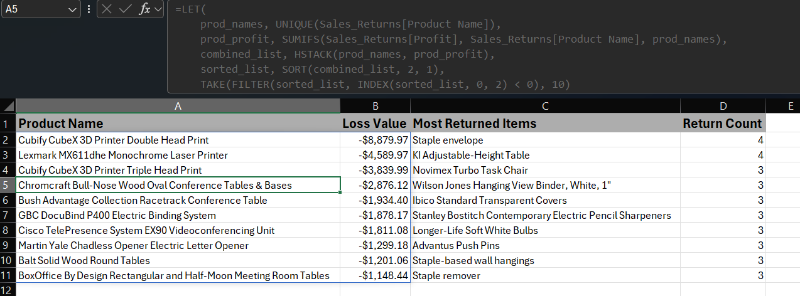
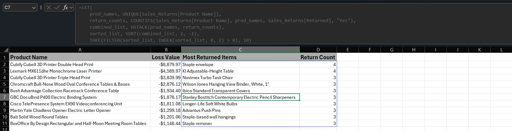
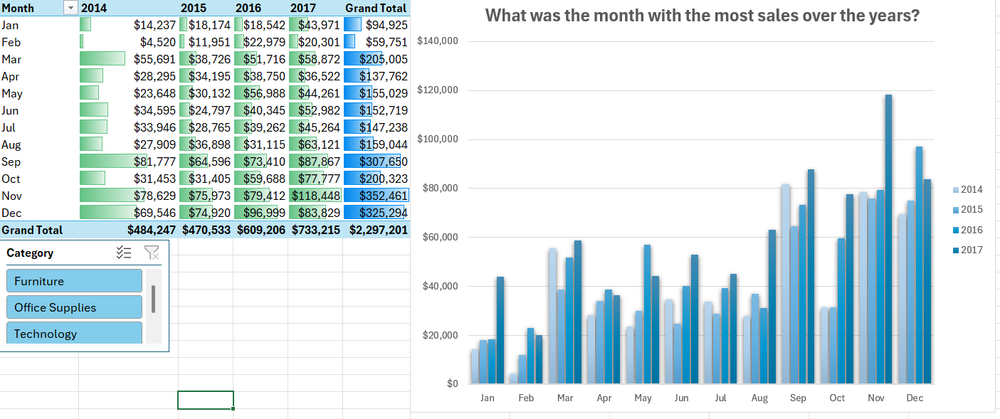
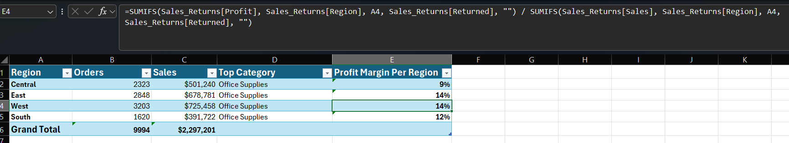
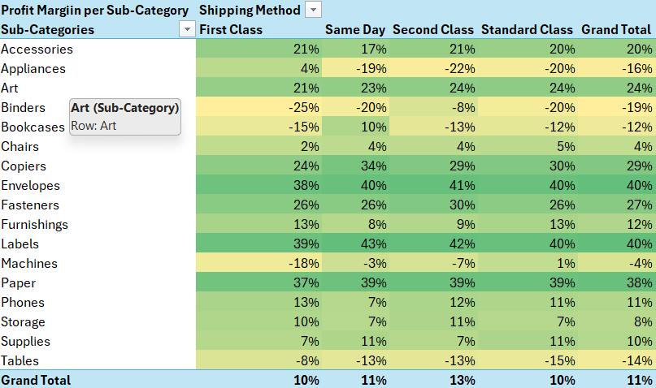
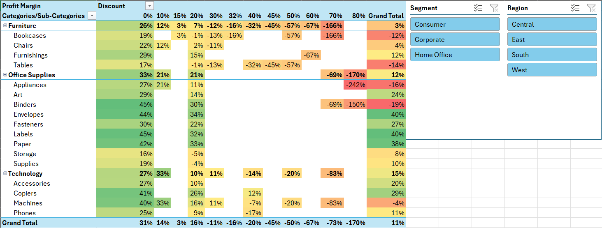
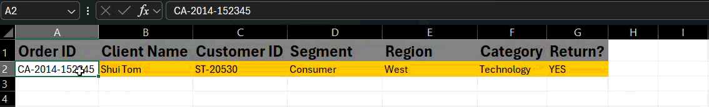

# Superstore Sales Analysis Project


### Table Of Contents: 
- [Superstore Sales Analysis Project](#superstore-sales-analysis-project)
    - [Table Of Contents:](#table-of-contents)
  - [Introduction](#introduction)
    - [Excel Analysis File](#excel-analysis-file)
  - [Research Questions](#research-questions)
    - [Technical Stack](#technical-stack)
    - [Formulas Used:](#formulas-used)
  - [The Analysis](#the-analysis)
    - [Key Findings: Sale Trends](#key-findings-sale-trends)
    - [Key Findings: Regional Efficency](#key-findings-regional-efficency)
    - [Key Findings: Shipping Impact](#key-findings-shipping-impact)
    - [Key Findings: Discount Effect](#key-findings-discount-effect)
  - [Dashboard View and XLookup](#dashboard-view-and-xlookup)
  - [Recommendations and Actionable Insights](#recommendations-and-actionable-insights)
  - [Conclusion](#conclusion)
  - [Connect With Me](#connect-with-me)

## Introduction
This project is a comprehensive Excel-based data analysis tool designed to track the performance of a multi-regional retail superstore. The dashboard integrates sales transactional data with return logs to provide a 360-degree view of business health, identifying high-loss categories, shipping inefficiencies, and regional trends.

*Data was sourced from* : [Here](https://trailhead.salesforce.com/trailblazer-community/files/069KX000005GNmKYAW?tab=overview)

### Excel Analysis File
You can find the file for the analysis here : [Superstore_sales_and_returns_analysis](../Superstore_sales_and_returns_2.xlsx)

## Research Questions
1. **The Profitability Gap**: Which product categories and sub-categories are the primary drivers of profit, and which are consistently underperforming or losing money?
2. **Seasonal Dynamics**: How do sales and profit trends fluctuate across different months or quarters? Are there specific "peak seasons" that require inventory adjustments?
3. **Regional Efficiency**: Which geographic regions (East, West, South, Central) exhibit the highest profit margins, and where is the cost of doing business disproportionately high?
4. **Shipping Impact**: What was the most profitable shipping method and was there a correlation between shipping method and what category of product or sub-category?
5. **Discount Sensitivity**: What is the relationship between discount levels and total profit? Is there a "tipping point" where discounts stop driving volume and start destroying value?

### Technical Stack
- **Excel**: The core tool used to showcase everything in the analysis.
- **Power Query**: Great help and the ETL process and to double check the dataset before working on it.
- **DAX**: Mainly was used for measures, quick and efficent.
- **Visual Code Studio**: For creating and presenting this very README.md file.
- **Git & GitHub**: Utilized for version control, documentation, and sharing my findings.

### Formulas Used:

- **XLOOKUP**
```excel 
=XLOOKUP(A2, Sales_Returns[Order ID], Sales_Returns[Customer Name], "Not Found")
```
- **IF + XLOOKUP (Return Status)**
  ```excel
  =IF(XLOOKUP(A2, Sales_Returns[Order ID], Sales_Returns[Returned], "NO")=0, "NO", "YES")
  ```
- **COUNTIF (Regional Order Count)**
  ```excel
  =COUNTIF(Sales_Returns[Region], A2)
  ```
- **SUMIFS (Regional Sales)**
  ```excel
  =SUMIFS(Sales_Returns[Sales], Sales_Returns[Region], A2)
  ```
- **SUMIFS (Profit Margin Calculation)**
  ```excel
  =SUMIFS(Sales_Returns[Profit], Sales_Returns[Region], A2, Sales_Returns[Returned], "") / 
  SUMIFS(Sales_Returns[Sales], Sales_Returns[Region], A2, Sales_Returns[Returned], "")
 
## The Analysis
My Approach was to inspect the data treat it as an actual real life task and create the questions based on real life propable objective or issues to point out and recommend an insight at the end.

1. **Top-Loss list**


By using *Dynamic Arrays* within excel I was able to determine using the formula shown the items that caused a net loss from the Superstore sales inventory.

At the same time again with the help of **LET**, **UNIQUE** and **TAKE** I was able to determine the items that was returned back the most using the following formula.



---
2. **Sale Trends**


Using **Pivot Tables** and with the included help of the built in **Charts & Slicers** options in **Excel** I was able to determine and visualize trends in the sale trends across the 4 year period on each month as well.
### Key Findings: Sale Trends
- *March* is usually the busiest month in terms of sales in **Q1** in all 4 years with **Technology** being the highest sale category.
- *September* Across all 4 years was the highest in sales in **Q3** While for it **Furniture** saw the most sales during the month.
- *November&December* both were the highest in sales across all 4 years consistently, especially considreing they are during the holiday seasons, With **Furniture** being the highest selling category for *December* and **Technology** for *November*.
---
3. **Regional Efficency**


Using **SUMIFS** and **Nested IFS** pulled out the sales and profit margin for each region, However needed to prep and clean the data first to do so, therfore used **Power Query** to **Merge** the 2 tables together of Sales and that of Returns to create new columns with **Left Outer Join** (Returned and Return Order ID) and to be able to Calculate **Profit Margin** in a new column while taking returned orders in consideration.

### Key Findings: Regional Efficency
- **Office Supplies** had the highest profit margin across all regions.
- **East&West** were the most profitable regions.
- We get more total orders in the **West** region
- Although we get more orders in **Central** region yet **South** region is more profitable.
---
4. **Shipping Impact**


Once again with the help of **Pivot Tables** and **Conditional Formatting** was able to sort and outline the profit margins based on each *Sub-category* by each shipping method the Superstore has to offer.

### Key Findings: Shipping Impact
- The Superstore is almost always profitable at the same margin in **Accessories**, **Art**, **Copiers**, and other small in size items mainly **Office Supplies** no matter the shipping method used.
- All shipping methods saw a loss in profit margin except for **First Class** when it came to **Appliances**.
- **Binders** always had a negative profit margin regardless the shipping method, as for **Bookcases** it was only profitable using **Same Day** shipping method.
- **Furnishings** had the highest profit margin when customers used **First Class** or **Standard Class** While **Phones** had the highest profit margin on **First Class**
- As for **Machines** it came at a loss in profit margin in all shipping methods except **Standard Class**.
---
5. **Discount Effect**


The above **Discount** heat-map made by the help of **Conditional Formatting** and accompanied by **Slicers** for Regions & Segments shows the effect of the discounts on the Superstore profit margins and if applying a discount was actually useful or not.

### Key Findings: Discount Effect
- The Profit margins were always negative in the grand view of things if a **30%** or more discount was applied.
- **Office Supplies** had the highest profitability when offered on a **20%** discount.
- For **Technology** Machines does best when a **10%** discount is offered on it while the rest of the items in the category do better on a **20%** discount.
- **Furniture** category made most profit when sold on no discount across all market segments.

## Dashboard View and XLookup

- The Dashboard to show dynamic change of **Sales**, **Profit** and **Orders** in total across all segments with the help of the **Slicer** included, With the added cards to split the sales values between categories to show the threshold of each category.
- The two charts included helps with a quick view of the sales trend across all the 4 year period with the ability to show sales for each month and the 2nd chard provides a total view of sales and profit margins for each region dynamically.

 
 - With the help of **XLookup** I was able to make a quick search sheet to be able to pull key info about the order in question through the **Order ID**.

 ## Recommendations and Actionable Insights

 Based on the in-depth analysis of the Superstore dataset over four years, several critical patterns have been observed that directly impact profitability and operations. For example, there are continuous losses due to high returns on certain products and sub-categories (e.g., Binders and Machines). Additionally, seasonal sales are observed in March (Technology-driven sales), September (Furniture-driven sales), and during the holiday season in November-December. Also, higher profitability is observed in the East and West regions, while Office Supplies show the highest profitability across all regions. Shipping has a major impact on profitability, where "First Class" shipping is optimal for profitability. Discounts of more than 20-30% always negatively impact profitability.
 
 - **Inventory & Returns Management (Top Loss List)**: Discontinue or renegotiate contracts for high-loss items such as those in the dynamic arrays. For most returned items, implement quality checks or customer feedback loops to reduce returns by 20-30%. Use the LET & UNIQUE formulas for this purpose on a quarterly basis.

 - **Sales Trend Optimization (Sale Trends)**: Take advantage of peak months such as March, September, and November/December by increasing marketing efforts for top categories like Technology in Q1 and November, and Furniture in Q3 and December. Plan inventory stocking 1-2 months in advance using pivot table forecasts to avoid stockouts during holidays.

 - **Regional Strategy Enhancements (from Regional Efficiency)**: Target East and West for higher profitability and explore why Central is under-performing with more orders received, possibly through deeper Power Query analysis on costs. Promote Office Supplies across all regions because they have the best margins and target a 10% increase in sales from South to take advantage of its efficiency.

 - **Refinements of Shipping Method (from Shipping Impact)**: Promote First Class shipping for Appliances and Furnishings to reduce loss, and use Same Day for profitable items like Bookcases. Stop shipping Binders and Machines by methods that show negative margins and consider bundling or other carriers.

 - **Discount Policy Changes (from Discount Effect)**: Avoid discounts of 30% or higher; cap most at 20% unless category-specific testing shows benefit. Category-specific: 10% discount for Technology Machines, 20% for other Tech and Office Supplies, and no discounts for Furniture Until further data analysis.
---
## Conclusion
This Excel-based analysis reveals that while the Superstore enjoys strong seasonal peaks and solid performance in Technology and Office Supplies, profitability is eroded by high-return/loss items (e.g., Binders, certain Machines), overly aggressive discounts, and suboptimal shipping choices for bulky goods. By implementing the recommendations targeted inventory pruning, category-specific discount policies, regional focus on East/West/South, and shipping optimizations the business could significantly improve margins without major operational overhauls.

## Connect With Me
Feel free to reach out if you have questions about the analysis or techniques used:

- [*LinkedIn*](https://www.linkedin.com/in/mina-gobran-02793029b/)
- [*Email*](Minamaher009@gmail.com)